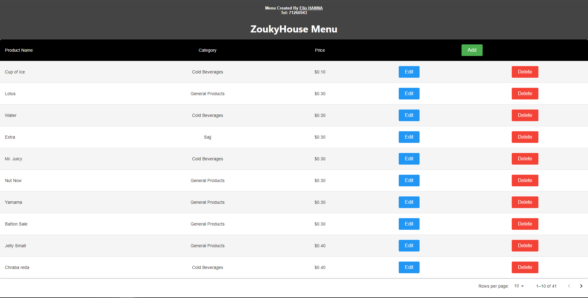

# My App

Welcome to zoukyhouse E-Menu! This is a sample readme file that provides an overview of the app and its features.

## Overview

My App is a web application built with React and Node.js. It allows users to check the e-menu and the admin to manage products in a simple and intuitive way. Users can view a list of products, Admins can add new products, edit existing products, and delete products.

## Features

- View a list of products with details such as name, category, and price.
- Add new products with name, category, and price.
- Edit existing products to update their information.
- Delete products to remove them from the list.

## Technologies Used

- React: A JavaScript library for building user interfaces.
- Node.js: A JavaScript runtime environment for server-side development.
- Express: A web application framework for Node.js.
- MySQL: An open-source relational database management system
- Prisma: An open-source database toolkit for Node.js.
- MUI (Material-UI): A popular React UI framework for building responsive and attractive user interfaces.
- Axios: A promise-based HTTP client for making API requests.

## Setup and Installation

1. Clone the repository: `git clone https://github.com/Elio-hanna/zoukyhouse-reactjs.git`
2. Navigate to the project directory: `cd zoukyhouse-reactjs`
5. Navigate to the backend directory: `cd backend`
6. Install dependencies for the backend: `npm install`
7. Start the backend server: `npm start`
8. Navigate to the frontend directory in a different cmd: `cd frontend`
9. Install dependencies for the backend: `yarn install`
10. Start the development server: `yarn start`
11. Open your browser and visit `http://localhost:3000` to access the app.

## Project Demo

### Home Page

The home page displays the e-menu with a list of products. Each product is shown with its name, category, and price. Users can browse through the products and view the details.

### Admin Page

The Admin page allows admins to manage the products. Admins can add new products, edit existing products, and delete products from the list.

To add a new product, click on the "Add" button. This will open the Add Product form where you can enter the product details and click "Add Product" to add the product.

To edit a product, click on the "Edit" button next to the product you want to modify. This will open the Edit Product form where you can update the product details and click "Save Changes" to apply the changes.

To delete a product, click on the "Delete" button next to the product you want to remove.

### Add Product Page

The Add Product page allows admins to add new products to the e-menu. Admins can enter the product details such as name, category, and price in the provided form fields.

Fill in the required fields and click "Add Product" to add the new product to the list.

### Edit Product Page

The Edit Product page allows admins to modify the details of an existing product. Admins can update the name, category, and price of the selected product.

Make the desired changes in the form fields and click "Save Changes" to update the product.

### Delete Product

The Delete Product functionality allows admins to remove a product from the list. When you click the "Delete" button next to a product, this will permanently delete the product from the e-menu.

## Acknowledgements

[Elio Hanna](https://github.com/Elio-hanna)
